# Java Best Practices
Best practices in Coding, Designing and Architecting Java Applications

## Coding

###How to become a good programmer?
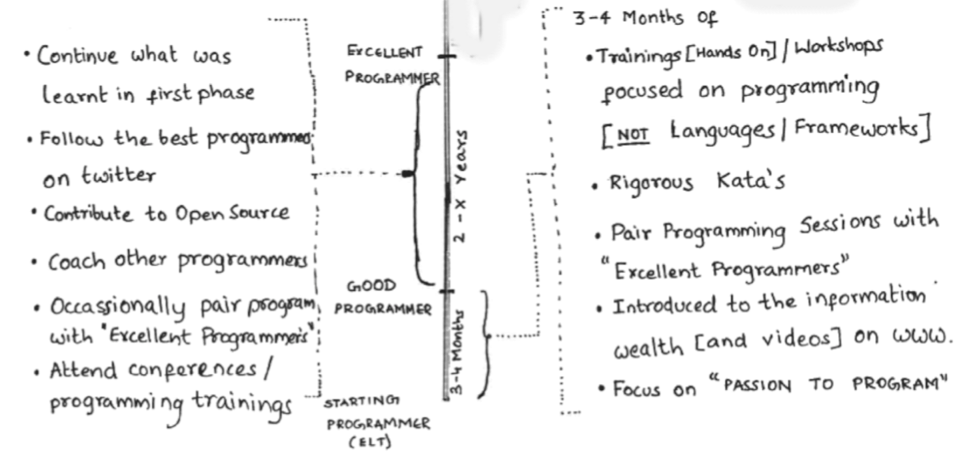

###Ask Why?
- Ask Why?

### Should I be an expert at all Design Patterns?
- My personal view : Design Patterns are good to know. Have a good idea on what each one of them does. But, that where it ends. I’m not a big fan of understanding the intricate details of each Design Pattern. You can look it up if you have a good overall idea about Design Patterns.
- Full Video on Design Patterns : https://www.youtube.com/watch?v=f5Rzr5mVNbY
- Java EE Design Patterns : https://github.com/in28minutes/Java-EE-Design-Patterns/blob/master/JavaEE%20Design%20Patterns%20and%20Architecture%20-%20Presentation%20v0.7.pdf
- Java Design Patterns : https://github.com/in28minutes/Design-Patterns-For-Beginners/blob/master/DesignPatterns-Presentation.pdf

### What is TDD?

### What is BDD?

### What is ATDD?

### What are NFRs?

### What is Sonar?

### Do not be fooled by Code Coverage?

### How can you increase performance and reliability of applications using Queues?

### What are the most important coding standards?
- Complexity of a method
- Naming variables, methods and classes
- Size of methods and classes
- Number of parameters

### Why is unit testing important?

### Why should a good programmer understand Mocking?

### Why is it important to have an API Standard?
- YARAS

### Why should you create a reference component?

### What is the importance of Logging and Centralized Monitoring?

### What happens behind Maven? What is a Repository?

### Automate! Automate! Automate!
- Why is it important? 
- Personal Experience with Deployment Automation, Providing user screen with requests/responses

### When should you have multiple CI builds?

### Why is performance of Unit Tests important?

### What are Cloud Native Applications?

### What are micro-services?

### Why should you avoid floats for Calculations?

### Why is it important to use Continuous Integration from Day 0 of the project?

### What is a vertical slice? Why should you need it?

### What is defensive programming?

### Why should you have minimum scope for variables?

### Why should you understand performance of String Concatenation?

### Why should you optimize judiciously?

### What are the best practices with Exception Handling?

### When is it recommended to prefer Unchecked Exceptions?
- Spring Framework

### When do you use a Marker Interface?

### Why are ENUMS important for Readable Code?

### Why should you minimize mutability?

### What is functional programming?

### Why should you prefer Builder Pattern to build complex objects?

### Why should you build the riskiest high priority features first?

### Why should you have api & impl in each layer maven projects?

### Why should you create small components?

### Why should you have coding standards?

### Why should you migrate to GIT?

### What are the 4 Principles of Simple Design?

### What is Pair Programming?

### Whatt are Best Practices of Distribute Agile?

### Why is readable code important?

### What is component based architecture?

### Why should you commit your code often? 

### What is use of Maven Parent POM?

### Why should you write unit tests with/before code?

### What are version control best practices
- Do not commit derived files.
- Do not commit IDE files.
- Commit often
- Use Git

### A few design patterns...

### Why do Stateless applications perform better?

###Code Quality Overview
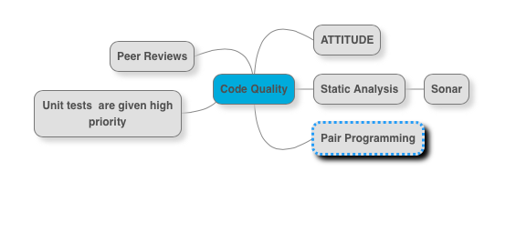

- More than everything else, code quality is an attitude. Either, the team has it or not. The attitude to refactor when something is wrong. The attitude to be a boy scout. As an architect, it is important to create an environment where such an attitude is appreciated. (There are always bad sheep, who take the code quality to such depth that it is not fun anymore, but I like them more than developers who keep churning out bad code).
- Have a good static analysis tool(and is part of Continuous Integration). Sonar is the best bet today. Understand the limits of Static Analysis. Static Analysis is not a magic wand. For me, results from Static Analysis are a signal: It helps me decide where I should look during peer or architect reviews?
- Have good peer review practices in place. Every user story has to be peer reviewed. Put more focus on peer reviews when there is a new developer or there is a new technical change being done. Make best use of Pair Programming. The debate is ongoing : Is pair programming more productive or not? I would rather stay out of it. You make your choice. However,  these two scenarios are bare minimum:
 - Onboarding a new programmer. Makes him comfortable with all the new things he has to encounter.
 - Implementing a complex functionality.
- Next question is how to approach a Code Review. Difficult to cover everything. I would make a start. When doing a code review, I start with static analysis results (for example, sonar). I spend 10 minutes getting an overview of components and/or layers (focusing on size and dependencies). Next I would pick up a unit test for a complex functionality. I feel unit tests are the best place to discover the dependencies and naming practices (I believe good names = 50% of maintainable code). If a programmer can write a simple and understandable unit test, he can definitely write good code. Next, I look for 4 principles of Simple Design. After this, there are 100 other things we can look for - You decide.

### Why should you not take code quality tools at face value?
- If a project has a great Sonar report, does it mean it is perfect? 
- Nope, code quality tools are just a guidance!
- Your focus should be to write code that adheres to "4 Principles of Simple Design"
- Peer Reviews are necessary!

## Security
Hmmm... Should I really explain the importance of Security?
Presentation : https://github.com/in28minutes/java-best-practices/blob/master/pdf/SecuringYourApplication-OWASP.pdf

## Performance

- First and Foremost - NO premature optimizations. Any optimization decision should be based on numbers or past experience. In Donald Knuth's paper "Structured Programming With GoTo Statements", he wrote: "Programmers waste enormous amounts of time thinking about, or worrying about, the speed of non critical parts of their programs, and these attempts at efficiency actually have a strong negative impact when debugging and maintenance are considered. We should forget about small efficiencies, say about 97% of the time: premature optimization is the root of all evil. Yet we should not pass up our opportunities in that critical 3%."
- Session size - Small
- Implement Caching whereever possible
- Set initial size on Collections
- Create necessary Indexes on Database. Collect Statistics and Remove unnecessary data
- In critical parts - write unit tests for performance.
- Be conscious about create as few objects as possible. Especially in loops.
- Avoid String Concatenation
- Close connections and Streams
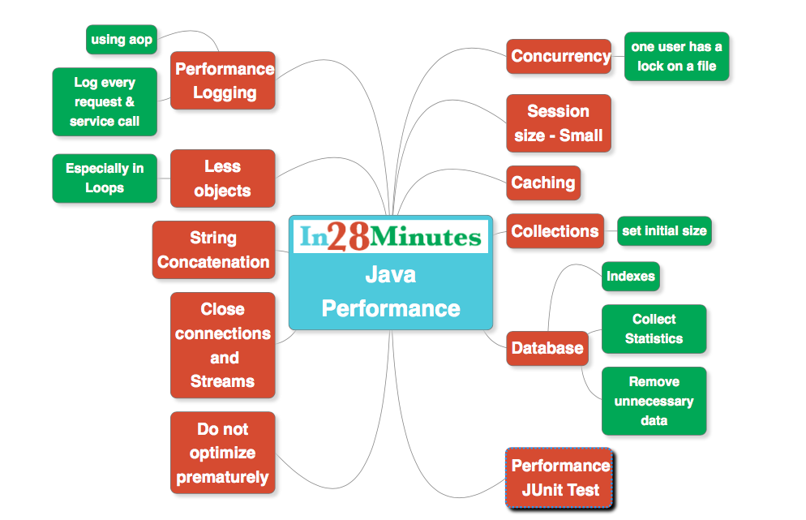

## Load and Performance Testing
- PDF Presentation https://github.com/in28minutes/java-best-practices/blob/master/pdf/LoadAndPerformanceTestingBestPractices.pdf
- Have clear performance objectives. That’s the single most important objective. Decide Peak Load, Expected Response Time, Availability Required before hand.
- Establish clear performance expectations with the Interface Services
- An application does not work on its own. It connects with a number of external interfaces. Establish clear performance expectations with the Interface Services
- The next important thing is to ensure that you mirror your production environment. A load testing environment should be the same as your production environment. We will discuss the exact factors involved later in this article.
- Validate early : Do performance testing as early as possible.
- Make it a regular practice to use profilers in development environment. ex:JProfiler
- Make sure team is not making premature optimizations. Any optimization decision should be based on numbers or past experience. In Donald Knuth's paper "Structured Programming With GoTo Statements", he wrote: "Programmers waste enormous amounts of time thinking about, or worrying about, the speed of non critical parts of their programs, and these attempts at efficiency actually have a strong negative impact when debugging and maintenance are considered. We should forget about small efficiencies, say about 97% of the time: premature optimization is the root of all evil. Yet we should not pass up our opportunities in that critical 3%."
- Have Clear Strategy on How to Handle expected load. What would be the initial settings on the application server? Do you plan to use a clustered environment? Do you need a load balancer?

## Design
###Design Focus Areas
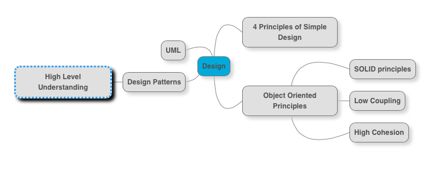
- 4 Principles of Simple Design. https://www.youtube.com/watch?v=OwS8ydVTx1c&list=PL066F8F24976D837C
 - Runs all tests
 - Minimize Duplication
 - Maximize Clarity
 - Keep it Small
- Object Oriented Programming. Have good object, which have well-defined responsibilities.  Following are the important concepts you need to have a good overview of. These are covered in various parts in the video https://www.youtube.com/watch?v=0xcgzUdTO5M. Also, look up the specific videos for each topic.
 - Coupling :
 - Cohesion : https://www.youtube.com/watch?v=BkcQWoF5124&list=PLBBog2r6uMCTJ5JLyOySaOTrYdpWq48vK&index=9
 - Encapsulation
 - Polymorphism : https://www.youtube.com/watch?v=t8PTatUXtpI&list=PL91AF2D4024AA59AF&index=5
 - SOLID Principles
- UML is next even though, formal use of UML is on the way down with Agile. However, I think UML is a great tool in the arsenal for a white board discussion on design. A picture is worth thousand words. I recommend having a good overview of the UML basics. Focus on these four before you move on to others.
 - Class diagrams
 - Sequence diagrams
 - Component diagrams
 - Deployment diagrams
- Design Patterns. Following video covers all the major design patterns. https://www.youtube.com/watch?v=0jjNjXcYmAU. My personal view : Design Patterns are good to know. Have a good idea on what each one of them does. But, that where it ends. I’m not a big fan of understanding the intricate details of each Design Pattern. You can look it up if you have a good overall idea about Design Patterns.

###Design Review
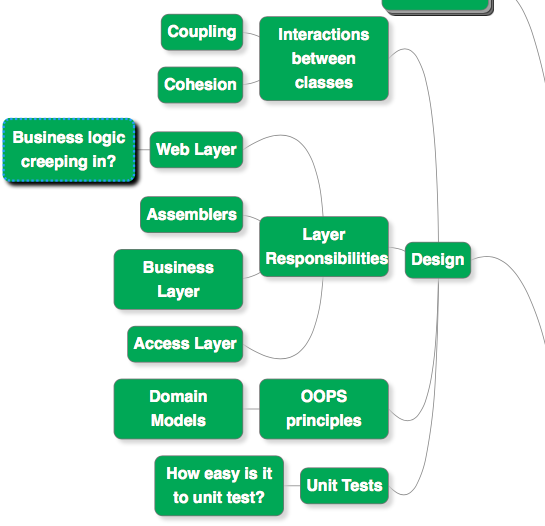

## Architecture
- PDF - How to be a good architect : https://github.com/in28minutes/java-best-practices/blob/master/pdf/How%20to%20be%20a%20good%20Software%20Architect.pdf

### Architect Responsibilities
- Having good governance in place. Good review processes in place for Architecture, Design and Code.
- Creating a clean architecture based on sound principles. Architecture covering all Non Functional Requirements.
- Ensuring teams are as productive as they can be. Right tools.
- Ensuring teams are following the best engineering practices.
- Ensuring clear communication about architecture with business and technical teams.
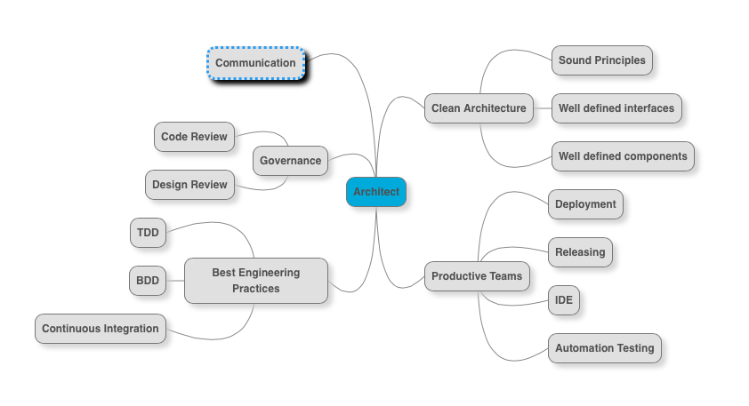

### Architect Qualities
Most important qualities I look for in an Architect are
- Impeccable Credibility : Somebody the team looks up to and aspires to be.
- Super diagnostic skills : The ability to do a deep dive on a technology issue. When developers are struggling with a problem (having tried different things),  Can he/she provide a fresh pair of eyes to look at the same problem?
- Forward Thinker and Proactive : Never satisfied with where we are. Identifies opportunities to add value fast.
- Great Communication :  Communication in the widest sense. Communicating the technical aspects to the stakeholders, project management, software developers, testers, etc.
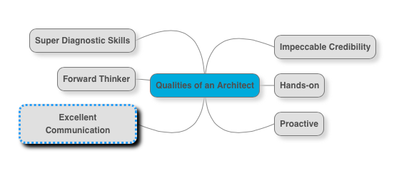

###Architecture Review
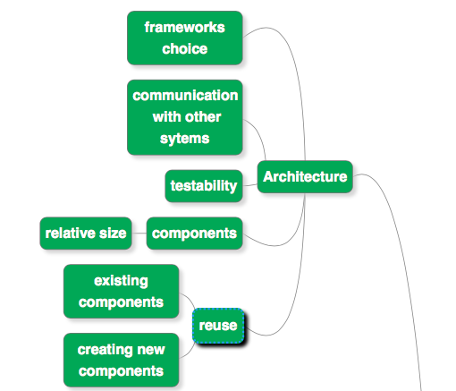

### SOAP Web Services
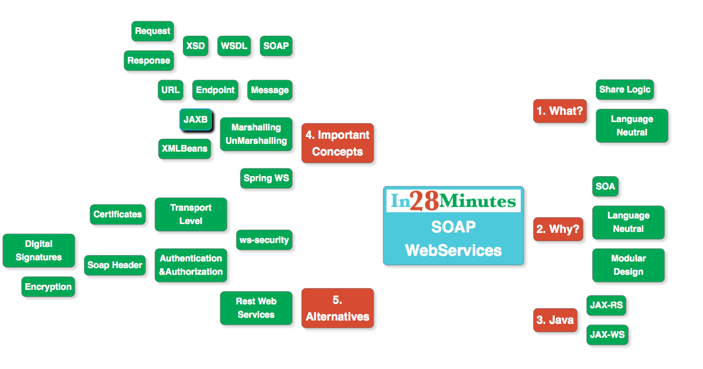

### REST Web Services
- PDF TO UPDATE https://www.mindmup.com/#m:g10B8KENIDghuHAYmFzM0daOU80SDA

#### How should you document your REST Web Services?
- Swagger

### Distributed Cache
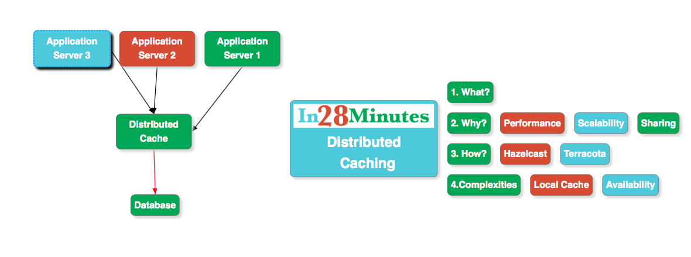

### Layers
- PDF https://github.com/in28minutes/java-best-practices/blob/master/pdf/LayeringInJavaApplications.pdf

#### Business Layer
Listed below are some of the important considerations
- Should I have a Service layer acting as a facade to the Business Layer?
- How do I implement Transaction Management? JTA or Spring based Transactions or Container Managed Transactions? What would mark the boundary of transactions. Would it be service facade method call?
- Can (Should) I separate any of the Business Logic into seperate component or service?
- Do I use a Domain Object Model?
- Do I need caching? If so, at what level?
- Does service layer need to handle all exceptions? Or shall we leave it to the web layer?
- Are there any Operations specific logging or auditing that is needed?Can we implement it as a cross cutting concern using AOP?
- Do we need to validate the data that is coming into the Business Layer? Or is the validation done by the web layer sufficient?

#### Data Layer
- Do we want to use a JPA based object mapping framework (Hibernate) or query based mapping framework (iBatis) or simple Spring DO?
- How do we communicate with external systems? Web services or JMS? If web services, then how do we handle object xml mapping? JAXB or XMLBeans?
- How do you handle connections to Database? These days, its an easy answer : leave it to the application server configuration of Data Source.
- What are the kinos of exceptions that you want to throw to Business Layer? Should they be checked exceptions or unchecked exceptions?
- Ensure that Performance and Scalability is taken care of in all the decisions you make.

#### Web Layer
- First question is do we want to use a modern front end javascript framework like AngularJS? If the answer is yes, most of this discussion does not apply. If the answer is no, then proceed?
- Should we use a MVC framework like Spring MVC,Struts or should we go for a Java based framework like Wicket or Vaadin?
- What should be the view technology?  JSP, JSF or Template Based (Velocity, Freemarker)?
- Do you want AJAX functionality?
- How do you map view objects to business objects and vice-versa? Do you want to have View Assemblers and Business Assemblers?
- What kind of data is allowed to be put in user session? Do we need additional control mechanisms to ensure session size is small as possible?
- How do we Authenticate and Authorize users? Do we need to integrated external frameworks like Spring Security?
- Do we need to expose external web services?

## Tools

### Maven Best Practices 
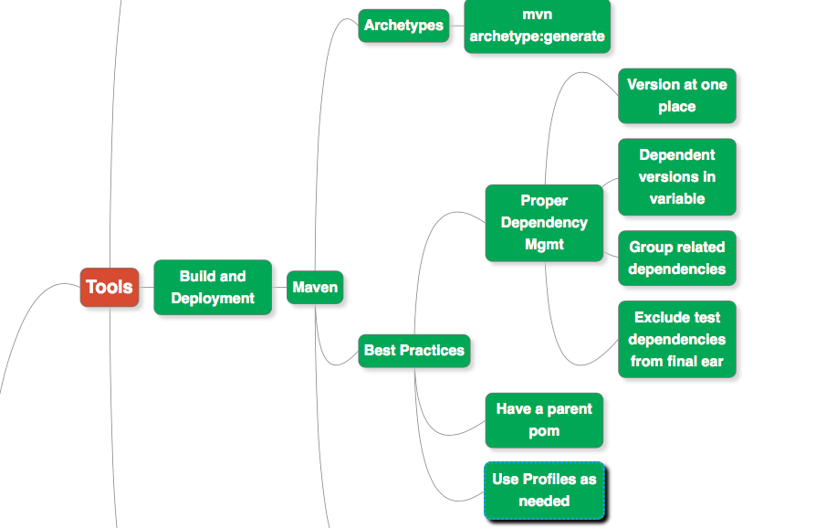

#### 10 Tips For Maven
[10 Tips for Eclipse and Maven](pdf/10TipsforEclipseAndMaven.pdf)

### IDE - Eclipse
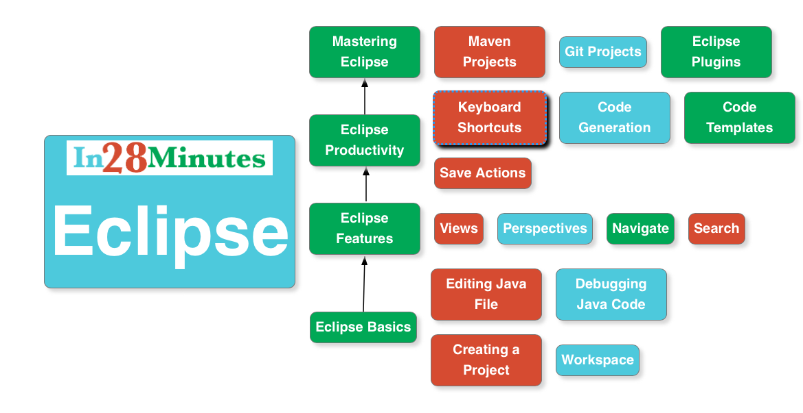

#### 10 Tips For Eclipse
[10 Tips for Eclipse and Maven](pdf/10TipsforEclipseAndMaven.pdf)

## Practices

### Agile and Architecture
- First of all I’m a great believer that agile and architecture go hand in hand. I do not believe agile means no architecture. I think agile brings in the need to separate architecture and design. For me architecture is about things which are difficult to change : technology choices, framework choices, communication between systems etc. It would be great if a big chunk of architectural decisions are made before the done team starts. There would always be things which are uncertain. Inputs to these can come from spikes that are done as part of the Done Scrum Team.But these should be planned ahead.
- Architecture choices should be well thought out. Its good to spend some time to think (Sprint Zero) before you make a architectural choice.
- I think most important part of Agile Architecture is Automation Testing. Change is continuous only when the team is sure nothing is broken. And automation test suites play a great role in providing immediate feedback.
- Important principles for me are test early, fail fast and automate.

###Agile and Design
[Design in Agile Projects](pdf/AgileAndDesign-Evolution.pdf)

### Modern Development Practices
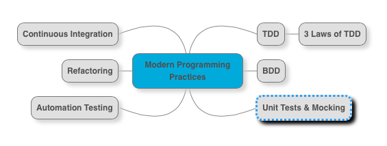
- Unit Testing and Mocking : We are in the age of continuous integration and delivery, and the basic thing that enables those is having a good set of unit test in place. (Don’t confuse unit testing with screen testing done manually to check if the screen flow is right. What I mean by unit testing is JUnit test’s checking the business logic/screen flow in a java method (or) set of methods). Understand JUnit. Here is a good start : https://www.youtube.com/watch?v=AN4NCnc4eZg&list=PL83C941BB0D27A6AF. Also understand the concept of Mocking. When should we mock? And when we should not? Complicated question indeed.  Understand one mocking framework : Mockito is the most popular one. Easymock is a good mocking framework as well.
- Automated Integration Tests. Automated Integration Tests is the second important bullet in enabling continuous delivery. Understand Fitnesse, Cucumber and Protractor.
- TDD (actually I wanted to put it first). Understand what TDD is. If you have never used TDD, then be ready for a rude shock.  Its not easy to change a routine you developed during decades (or years) of programming. Once you are used to TDD you never go back. I promise. This list of videos is a good start to understanding TDD. https://www.youtube.com/watch?v=xubiP8WoT4E&list=PLBD6D61C0A9F671F6. Have fun.
- BDD. In my experience, I found BDD a great tool to enable communication between the ready team (Business Analysts, Product Owner) and the done team (Developers, Testers, Operations). When User Stories are nothing but a set of scenarios specified is GWT (Given When Then) format, it is easy for the done team to chew at the user story scenario by scenario.  With tools like Cucumber & Fitnesse, tooling is not far behind too. Do check BDD out.
- Refactoring. Is there an Architect who does not encounter bad code? Understand refactoring. Understand the role of automation tests in refactoring.
- Continuous Integration. Every project today has continuous integration. But, the real question is “What is under Continuous Integration?”. Compilation, unit tests and code quality gate(s) is the bare minimum. If you have integration and chain tests, wonderful. But make sure the build does not take long. Immediate feedback is important. If needed, create a separate build scheduled less frequently for slower tests (integration and chain tests). Jenkins is the most popular Continuous Integration tool today.
[[ModernDevelopmentPractices.png]]

#### Important Questions
- How often is code commited?
- How early are problems/defects found/fixed?
-- Code Quality, Code Review, ST Defects 
- Broken Builds?
- How often is code deployed to production?
- How often is code deployed to test environment?
- How different is deploying code to local or test environment from deploying code to production? 
- What steps are in continuous integration? More steps in continuous integration means more stability.
 - Compilation
 - Unit Tests
 - Code Quality Gates
 - Integration Tests
 - Deployment
 - Chain Tests
- How long does a Continuous Integration build run for? Is there a need for multiple builds?

### Productive Developers

### Unit Testing Best Practices
[Unit Testing Best Practices](pdf/UnitTestingBestPractices.pdf)

### Code Reviews

###Static Code Analysis
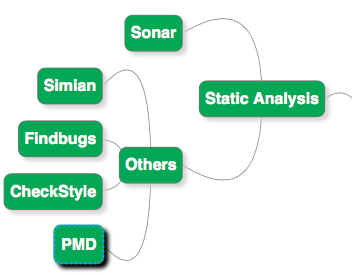

### Code Quality
https://github.com/in28minutes/java-best-practices/blob/master/pdf/CodeQuality.pdf
### Code Reviews
- PDF : https://github.com/in28minutes/java-best-practices/blob/master/pdf/CodeReview-BestPractices.pdf

### SONAR
- One Slide from PDF - Making use of SONAR 
- https://github.com/in28minutes/java-best-practices/blob/master/pdf/CodeQuality.pdf

## Indian IT
### How to create Good Programmers?

## Campus Interview Guide
- https://docs.google.com/document/d/1IP6HNgpMdCAAJEREowfBj2XPLBrPcIIFNIGFPGX0-ao/edit#heading=h.byb5dl2v0c4p

## Framework Comparison
- Spring MVC vs Struts
- Mockito vs EasyMock
- Mockito vs JUnit